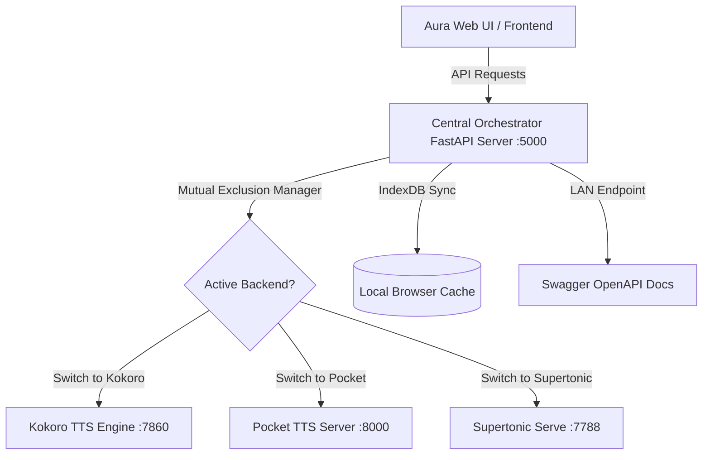

# 🎙️ Aura TTS — Unified Local Speech Workstation

[](https://fastapi.tiangolo.com)
[](https://python.org)
[](https://pytorch.org)
[](#)

Aura TTS is a premium, offline-first unified workstation that orchestrates multiple state-of-the-art open-source text-to-speech (TTS) backends under a sleek, glassmorphic UI. Designed to handle intense neural computing workloads on standard workstations, Aura manages engine lifecycle and memory constraints through **mutual exclusion**, preventing VRAM/RAM contention while delivering high-fidelity voice synthesis, zero-shot cloning, and style mixing.

---

## 🌟 Key Architecture & Workflows

Aura TTS brings together three separate voice synthesis backends into a unified orchestrator:



### 1. 🦙 Kokoro TTS Local Backend (Port `7860`)
* **Core tech**: High-quality local neural voice engine.
* **Best for**: Ultra-fast, whisper-quiet voice synthesis with multiple standard voices.
* **Features**: Language prefix recognition (English, Spanish, French, Chinese, Japanese, Portuguese, Hindi, Italian).

### 2. 🎙️ Pocket TTS Server Backend (Port `8000`)
* **Core tech**: OpenAI-compatible speech server.
* **Best for**: Dynamic, Zero-Shot voice cloning.
* **Features**: Accepts raw celebrity reference voice audio prompts (MP3, WAV, OGG, FLAC) and uses `ffmpeg` under the hood to automatically transcode reference files into highly precise 24kHz mono 16-bit WAV files.

### 3. ⚡ Supertonic Serve Backend (Port `7788`)
* **Core tech**: Professional custom voice style server.
* **Best for**: Advanced mathematical timbre blending.
* **Features**: Takes two separate voice profiles (style vectors `style_ttl` and `style_dp` containing multi-dimensional JSON data arrays) and blends them using a dynamic vector interpolation algorithm (linear weighted average via NumPy) to build custom hybrid speaker profiles.

---

## ⚡ Main Features

### 🗣️ Unified Speech Canvas (Chat Playground)
Interactive workspace feed with real-time audio players, speed controls ($0.5\times$ to $2.0\times$), language-specific options, and seamless model hot-swapping.

### 📊 Telemetry Hardware HUD
Built-in hardware utilization monitors. Track CPU and RAM consumption directly inside the Aura settings drawer in real-time, with global controls to instantly terminate offline services.

### 📂 Bulk Batch Speech Importer
Drag and drop spreadsheets (`.csv`) or plain script files (`.txt`). Parse columns dynamically and generate a queued sequence of syntheses offline, complete with audio downloads.

### 🎨 Mathematical Preset Style Mixer
Import custom `.json` voice style matrices, adjust the mathematical blend ratio slider, and save the mixed timbre. The orchestrator automatically registers the newly combined profile inside the active Supertonic server.

### 🌐 LAN Sharing & Developer API
Aura automatically binds to your local LAN network IP address. Share your local neural workstation with third-party software, mobile apps, or smart home integrations. Complete with dynamic Swagger documentation at `http://localhost:5000/docs`.

---

## 🛠️ Setup & Installation

Aura is packed with an automated, single-command installer script that prepares your local environment, installs dependencies, handles PyTorch CPU optimizations, and addresses dependency versions.

### Prerequisites
Make sure you have **Python 3.10 or higher** installed.

### 1. Initialize Virtual Environment
Create a local Python virtual environment to isolate dependencies:
```powershell
python -m venv venv
```

### 2. Run the Unified Setup Script
Run the automated installer to download and configure PyTorch, FastAPI, Kokoro, Pocket, and Supertonic dependencies:
```powershell
python install_all.py
```
*What the installer does:*
1. Upgrades core package utilities (`pip`, `setuptools`, `wheel`).
2. Installs a high-compatibility, CPU-optimized **PyTorch Stable** bundle (`torch`, `torchvision`, `torchaudio`).
3. Installs FastAPI, Uvicorn, psutil, requests, and standard file utilities.
4. Walks through sub-directories (`kokoro-tts-local`, `pocket-tts-server`) to compile their requirements.txt files.
5. Installs the `supertonic[serve]` module extension.
6. Re-installs and locks `numpy==1.26.4` to prevent version collisions.

---

## 🚀 Launching Aura TTS

Boot the workstation and open the dashboard using the automated launcher script:

```powershell
.\run_aura_portal.bat
```
*Alternatively, run it manually:*
```powershell
venv\Scripts\python.exe central_server.py
```
Once started, the CLI will output your local network endpoints, and the dashboard will automatically load at:
👉 **[http://127.0.0.1:5000](http://127.0.0.1:5000)**

---

## 🧑‍💻 Developer Integration (LAN API Example)

Integrating Aura TTS into custom scripts is simple. The orchestrator acts as a proxy for all three backends:

```python
import requests

# Binds to the central FastAPI orchestrator
url = "http://127.0.0.1:5000/api/tts"

payload = {
    "text": "Hello, world! This speech is being generated locally offline via Aura TTS.",
    "voice": "af_sarah", # Target speaker ID
    "speed": 1.0,         # Speech rate multiplier
    "lang": "en"          # Target language
}

response = requests.post(url, json=payload)

if response.status_code == 200:
    with open("output.wav", "wb") as f:
        f.write(response.content)
    print("Success! Speech generated and saved to output.wav.")
else:
    print(f"Error: {response.status_code} - {response.text}")
```

---

## 🧠 Under the Hood: Vector Blend Interpolation

Aura's style blender performs element-wise floating-point vector interpolation on Supertonic profiles.
When mixing voice profiles $A$ and $B$ with weight $w \in [0.0, 1.0]$, it extracts the two distinct dimensions (`style_ttl` and `style_dp`) and interpolates:

$$\vec{V}_{\text{mixed}} = (1 - w)\vec{V}_A + w\vec{V}_B$$

This creates mathematically balanced acoustic characteristics (pitch, stress, timber, and rhythm) directly from local voice vectors without retraining or fine-tuning a neural network.

---

## 🔒 Local & Sandboxed

Aura works **100% offline**. All text scripts, user database profiles, and cached speech records are saved in your web browser's sandboxed **IndexedDB** database, ensuring absolute privacy. No audio is ever uploaded to external servers.
