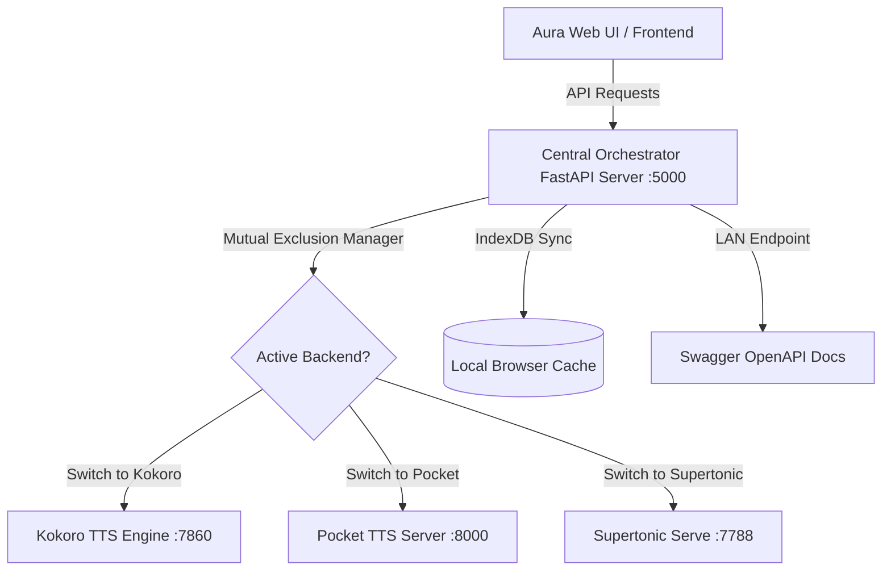

# 🎙️ Aura TTS — Unified Local Speech Workstation

[](https://fastapi.tiangolo.com)
[](https://python.org)
[](https://pytorch.org)
[](#)

Aura TTS is a premium, offline-first unified workstation that orchestrates multiple state-of-the-art open-source text-to-speech (TTS) backends under a sleek, glassmorphic UI. Designed to handle intense neural computing workloads on standard workstations, Aura manages engine lifecycle and memory constraints through **mutual exclusion**, preventing VRAM/RAM contention while delivering high-fidelity voice synthesis, zero-shot cloning, and style mixing.

---

## 🌟 Key Architecture & Workflows

Aura TTS brings together three separate voice synthesis backends into a unified orchestrator:



### 1. 🦙 Kokoro TTS Local Backend (Port `7860`)
* **Core tech**: High-quality local neural voice engine.
* **Best for**: Ultra-fast, whisper-quiet voice synthesis with multiple standard voices.
* **Features**: Language prefix recognition (English, Spanish, French, Chinese, Japanese, Portuguese, Hindi, Italian).

### 2. 🎙️ Pocket TTS Server Backend (Port `8000`)
* **Core tech**: OpenAI-compatible speech server.
* **Best for**: Dynamic, Zero-Shot voice cloning.
* **Features**: Accepts raw celebrity reference voice audio prompts (MP3, WAV, OGG, FLAC) and uses `ffmpeg` under the hood to automatically transcode reference files into highly precise 24kHz mono 16-bit WAV files.

### 3. ⚡ Supertonic Serve Backend (Port `7788`)
* **Core tech**: Professional custom voice style server.
* **Best for**: Advanced mathematical timbre blending.
* **Features**: Takes two separate voice profiles (style vectors `style_ttl` and `style_dp` containing multi-dimensional JSON data arrays) and blends them using a dynamic vector interpolation algorithm (linear weighted average via NumPy) to build custom hybrid speaker profiles.

---

## ⚡ Main Features

### 🎨 Premium UI/UX Workstation Workspace
Features a unified, glassmorphic workstation dashboard optimized for daily content operations. Contains dynamic tab/workspace titles that sync automatically on renames, strict engine-specific Cloning voice filtering, and a sleek, self-contained **Sidebar-Integrated Timbre Testing Deck** with inline synthesis text prompt entry and seekable audio cards.

### 🛡️ Dual-Stack Localhost socket validation
Ensures robust server state monitoring on Windows architectures by conducting dual-stack socket checks on both IPv4 (`127.0.0.1`) and IPv6 (`::1`) loopback addresses, preventing server binding conflicts and socket lockouts.

### ⚡ True Sub-100ms Real-Time PCM Streaming Pipeline
Bypasses traditional WAV header compilation bottlenecks. The orchestrator exposes a unified, chunk-by-clause `/api/tts/stream` endpoint proxy that streams raw 16-bit PCM bytes dynamically from Kokoro, Pocket, and Supertonic, ensuring instantaneous Time to First Byte (TTFB) playback.

### 🎯 Robust Isolated Multi-Mode Cancellation
Features multi-session `AbortController` tracking per chat playground and batch project. Historical playback operations (like playing or seeking cached audio cards) are fully isolated and **no longer** cancel active generation fetches or background synthesis tasks.

### 🗣️ Unified Speech Canvas (Chat Playground)
Interactive workspace feed with real-time audio players, speed controls ($0.5\times$ to $2.0\times$), language-specific options, and seamless model hot-swapping.

### 🧩 Mathematically Bounded Split-Synthesis & WAVE Binary Concatenation Engine
Allows the synthesis of scripts and prompts of any length. Long scripts are sliced at natural, punctuation-friendly boundaries into segments under 200 characters to bypass ONNX attention limits (preventing model broadcast failures like `1000 by 1485`). The backends run synthesis in parallel and dynamically recompile PCM WAV files by parsing and splicing their binary headers into a single lossless master `.wav` file.

### 🔍 Multi-Version Custom Style Cache Scanning
Upgraded path scanning engine that automatically detects custom cloned and blended speaker profiles across `supertonic3`, `supertonic2`, and `supertonic` directories, preventing style loading failures.

### 🛡️ Active Voice Validation Safeguard
Instantly checks and resets selected speaker IDs when hot-swapping engines (e.g. switching from Pocket's cloned voices to Kokoro's neural voices), preventing `400 Unknown Voice` mismatch errors.

### 📊 Telemetry Hardware HUD
Built-in hardware utilization monitors. Track CPU and RAM consumption directly inside the Aura settings drawer in real-time, with global controls to instantly terminate offline services.

### 📂 Bulk Batch Speech Importer
Drag and drop spreadsheets (`.csv`) or plain script files (`.txt`). Parse columns dynamically and generate a queued sequence of syntheses offline, complete with audio downloads.

### 🎨 Mathematical Preset Style Mixer
Import custom `.json` voice style matrices, adjust the mathematical blend ratio slider, and save the mixed timbre. The orchestrator automatically registers the newly combined profile inside the active Supertonic server.

### 🌐 LAN Sharing & Developer API
Aura automatically binds to your local LAN network IP address. Share your local neural workstation with third-party software, mobile apps, or smart home integrations. Complete with dynamic Swagger documentation at `http://localhost:5000/docs`.

---

## 🛠️ Setup & Installation

Aura is packed with an automated, single-command installer script that prepares your local environment, installs dependencies, handles PyTorch CPU optimizations, and addresses dependency versions.

### Prerequisites
Make sure you have **Python 3.10 or higher** installed.

### 1. Initialize Virtual Environment
Create a local Python virtual environment to isolate dependencies:
```powershell
python -m venv venv
```

### 2. Run the Unified Setup Script
Run the automated installer to download and configure PyTorch, FastAPI, Kokoro, Pocket, and Supertonic dependencies:
```powershell
python install_all.py
```
*What the installer does:*
1. Upgrades core package utilities (`pip`, `setuptools`, `wheel`).
2. Installs a high-compatibility, CPU-optimized **PyTorch Stable** bundle (`torch`, `torchvision`, `torchaudio`).
3. Installs FastAPI, Uvicorn, psutil, requests, and standard file utilities.
4. Walks through sub-directories (`kokoro-tts-local`, `pocket-tts-server`) to compile their requirements.txt files.
5. Installs the `supertonic[serve]` module extension.
6. Re-installs and locks `numpy==1.26.4` to prevent version collisions.

---

## 🚀 Launching Aura TTS

Boot the workstation and open the dashboard using the automated launcher script:

```powershell
.\run_aura_portal.bat
```
*Alternatively, run it manually:*
```powershell
venv\Scripts\python.exe central_server.py
```
Once started, the CLI will output your local network endpoints, and the dashboard will automatically load at:
👉 **[http://127.0.0.1:5000](http://127.0.0.1:5000)**

### 📊 Real-Time Latency Benchmarking
To measure empirical performance, Time to First Byte (TTFB) percentiles, and Real-Time Factors (RTF) across all three local engines, run the automated benchmark script:
```powershell
& "venv\Scripts\python.exe" "scratch\benchmark_tts.py"
```

### 🧪 Programmatic LAN Integration & Testing Suite
To validate the entire orchestrator, dual-stack localhost port configurations, and voice generation capacity dynamically over standard LAN endpoints, run:
```powershell
& "venv\Scripts\python.exe" "test_LAN.py"
```
*What the programmatic test suite automates:*
1. **Network Discovery**: Queries the central FastAPI orchestrator's `/api/status` endpoint to locate local network and loopback interface bindings.
2. **Sequential Model Swapping**: Triggers API switches via `/api/switch` to warm-load the three neural engines (`kokoro`, `pocket`, `supertonic`) sequentially, verifying they stabilize and bind cleanly to their respective backend ports.
3. **Voice Manifest Verification**: Queries `/api/voices` for each loaded backend to list all available standard and custom voice styles.
4. **Speech Generation Verification**: Automatically initiates unified POST `/api/tts` requests to synthesize text speech, captures raw binary streams, and writes them locally as high-fidelity WAV files for visual/auditory validation:
   - `output_kokoro.wav`
   - `output_pocket.wav`
   - `output_supertonic.wav`

---

## 🧑‍💻 Developer Integration (LAN API Example)

Integrating Aura TTS into custom scripts is simple. The orchestrator acts as a proxy for all three backends:

```python
import requests

# Binds to the central FastAPI orchestrator
url = "http://127.0.0.1:5000/api/tts"

payload = {
    "text": "Hello, world! This speech is being generated locally offline via Aura TTS.",
    "voice": "af_sarah", # Target speaker ID
    "speed": 1.0,         # Speech rate multiplier
    "lang": "en"          # Target language
}

response = requests.post(url, json=payload)

if response.status_code == 200:
    with open("output.wav", "wb") as f:
        f.write(response.content)
    print("Success! Speech generated and saved to output.wav.")
else:
    print(f"Error: {response.status_code} - {response.text}")
```

---

## 🧠 Under the Hood: Vector Blend Interpolation

Aura's style blender performs element-wise floating-point vector interpolation on Supertonic profiles.
When mixing voice profiles $A$ and $B$ with weight $w \in [0.0, 1.0]$, it extracts the two distinct dimensions (`style_ttl` and `style_dp`) and interpolates:

$$\vec{V}_{\text{mixed}} = (1 - w)\vec{V}_A + w\vec{V}_B$$

This creates mathematically balanced acoustic characteristics (pitch, stress, timber, and rhythm) directly from local voice vectors without retraining or fine-tuning a neural network.

---

## 🔒 Local & Sandboxed

Aura works **100% offline**. All text scripts, user database profiles, and cached speech records are saved in your web browser's sandboxed **IndexedDB** database, ensuring absolute privacy. No audio is ever uploaded to external servers.

---

## 🤝 Open-Source Contribution Guide & Wishlist

Aura TTS is built for the developer community! We welcome contributions, optimization pull requests, and features from neural speech enthusiasts. Here is our current open-source contributor wishlist:

### 🌟 Active Wishlist for Contributors:
1. **🚀 Pocket-TTS Multi-GPU Batching & Load Balancing:**
   * Extend the `/api/tts` proxy to dispatch batch synthesis tasks across multiple local GPUs in parallel, optimizing long-form audio generation.
2. **🎙️ Voice-Clone VAD (Voice Activity Detection) Filters:**
   * Integrate Silero VAD into the Pocket transcode pipeline to automatically strip silence, coughs, or noise from celebrity reference files before zero-shot voice cloning.
3. **🎭 Emotive Expression Vectors (Kokoro):**
   * Map structural punctuation (e.g. `[excited]`, `[whispering]`, `...`) to speed and emotional scale factors to enable dramatic voice styling.
4. **📦 Dockerized Orchestrator:**
   * Compose a multi-container Docker configuration (`docker-compose.yml`) that spins up Kokoro, Pocket, and Supertonic with NVIDIA CUDA GPU passthroughs configured automatically.

---

## 🗺️ Future Planning & Roadmap

We are committed to making Aura TTS the most comprehensive, localized neural speech workstation in the open-source ecosystem.

* **Phase 1: Real-Time Audio Streaming (WebSocket-based):**
  * Transition from stateless HTTP chunking to stateful WebSocket pipelines so that synthesised phonemes begin streaming instantly to the browser speakers as soon as the first word is compiled.
* **Phase 2: RAG-Speech Integration (Local LLM Reader):**
  * Build a local agent plugin using Ollama/Llama.cpp that lets the workstation read, summarize, and narrate your local documents off a custom knowledge base.
* **Phase 3: Multi-Platform Mobile Companion:**
  * Build a lightweight React Native frontend that pairs with Aura's local LAN API endpoints so you can run speech generation on your computer and play it on your phone.

---

## 📖 Continuation Guide (Local Learning & Deployment)

Aura TTS is an outstanding playground for learning neural network deployment, audio DSP (Digital Signal Processing), and REST orchestrator design. Here is how you can use this project to learn:

### 🧠 Core Concepts You Will Master:
* **Binary Audio Splicing:** Look at `concatenate_wav_buffers` in `central_server.py` to see how raw binary buffers are modified. Learn how PCM byte offsets are read and how the 44-byte WAV header is dynamically repacked.
* **Hardware Mutual Exclusion:** Study the sub-process termination logic in `central_server.py` to understand how heavy CUDA weights are unloaded and loaded in VRAM dynamically to prevent hardware contention.
* **IndexedDB Architecture:** Open DevTools in your browser (`F12` -> Application -> IndexedDB) to inspect how modern client-side databases can cache megabytes of lossless binary audio arrays securely and performantly offline.

### 💻 Deploying Locally for Your Team:
1. Run Aura on your most powerful workstation: `.\run_aura_portal.bat`.
2. Look at the startup CLI log to get your local network IP (e.g. `http://192.168.1.45:5000`).
3. Share this address with anyone on your local Wi-Fi or LAN. They can open the dashboard in their browsers and generate high-fidelity speech instantly, sharing the server’s GPU capacity!

